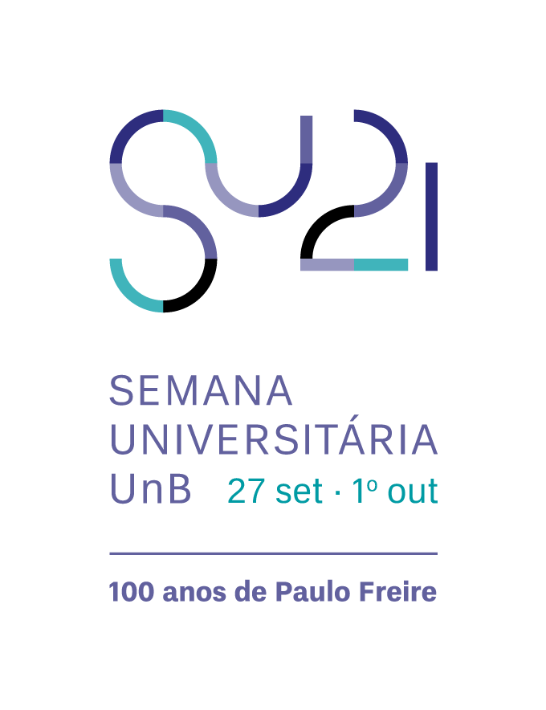

# Curso de Python para Iniciantes

Esse curso fez parte da Semana Universitária 2021 da Universidade de Brasília, evento que teve como tema a comemoração dos 100 anos de Paulo Freire.

Mais informações sobre o evento podem ser encontradas em

http://dex.unb.br/semanauniversitariaunb

O curso foi ministrado, por mim, Adriano Possebon Rosa, professor do Departamento de Engenharia Mecânica da UnB, entre 27/09/2021 e 01/10/2021. 

Foram 5 aulas no total, com 2 horas cada. As aulas estão disponíveis no youtube

> aula 1: https://youtu.be/9KInudOeh_U

> aula 2: https://youtu.be/Pe-FldAIMuo

> aula 3: https://youtu.be/qKWb8sj9Yn8

> aula 4: https://youtu.be/ruzqUD_5YwE

> aula 5: https://youtu.be/Qr10uesEVUg

A programação completa do curso e todos os outros detalhes estão no arquivo

> **Curso_Python_Semuni_Slides.pdf** 

O curso completo (com todos os códigos) está no arquivo 

> **Curso_Python_Semuni_Jupyter.ipynb**

O curso completo também está em formato pdf, no arquivo

> **Curso_Python_Semuni_Jupyter.pdf**

Se você tiver críticas, sugestões e/ou comentários sobre esse material por favor me envie uma mensagem (aprosa@unb.br). 